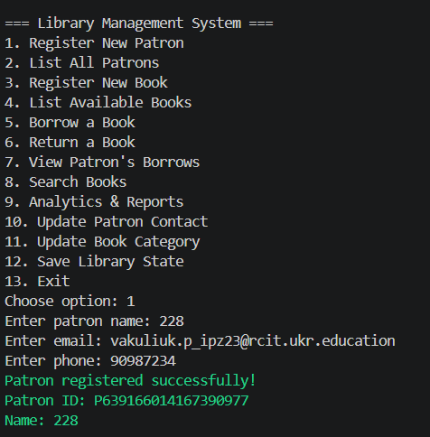
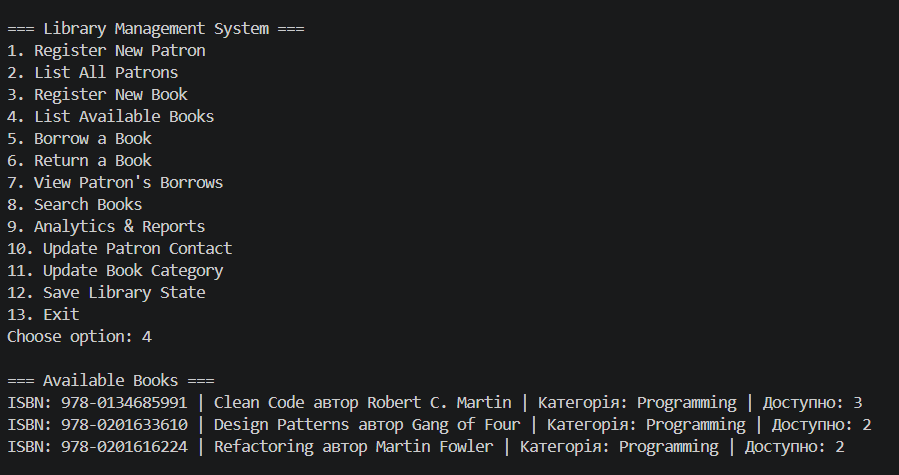
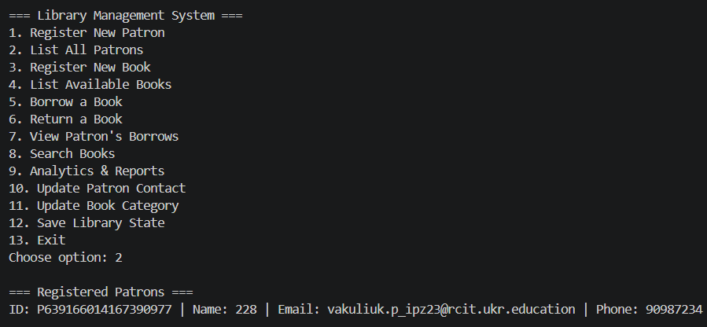
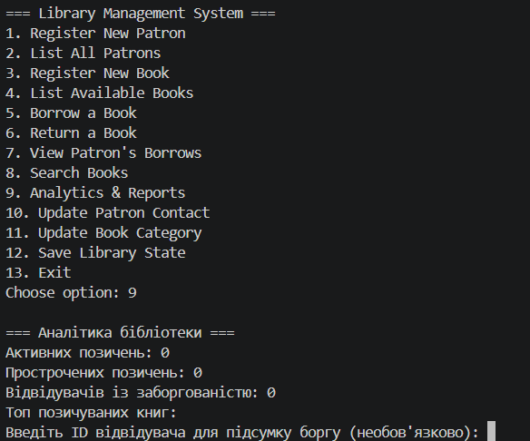
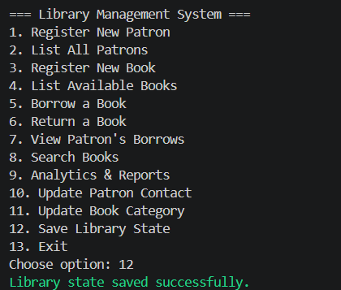

# Система Управління Бібліотекою

Комплексний міні-проект ООП, що реалізує систему управління бібліотекою з шарованою архітектурою, демонструючи принципи SOLID, патерни проектування та практики чистого коду.

## Огляд Проекту

Система Управління Бібліотекою (LMS) - це консольний додаток, що керує операціями бібліотеки, включаючи:
- Реєстрація та управління відвідувачами
- Управління інвентарем книг
- Позичення та повернення книг
- Відстеження штрафів за прострочення

Цей проект служить як освітня реалізація для Ітерації 1 міні-проекту ООП Lab 34.

## Архітектура

Система дотримується патерну **Шарової Архітектури** з чітким розділенням відповідальності:

```
src/
├── LibraryManagementSystem.Domain/          # Бізнес-сутності та правила
│   ├── Book.cs                              # Сутність книги з валідацією
│   ├── Copy.cs                              # Фізична копія книги
│   ├── Patron.cs                            # Відвідувач бібліотеки
│   ├── BorrowRecord.cs                      # Запис транзакції позичення
│   ├── OverduePolicy.cs                     # Бізнес-правила для штрафів за прострочення
│   ├── CopyStatus.cs                        # Перерахування для статусу копії
│   └── Repositories/                        # Інтерфейси репозиторіїв
│       └── IPatronRepository, IBookRepository, IBorrowRepository
│
├── LibraryManagementSystem.Application/     # Бізнес-логіка та випадки використання
│   ├── PatronService.cs                     # Логіка управління відвідувачами
│   ├── BookService.cs                       # Логіка управління книгами
│   └── BorrowService.cs                     # Оркестрація позичень
│
├── LibraryManagementSystem.Infrastructure/  # Реалізації доступу до даних
│   ├── InMemoryPatronRepository.cs          # In-memory зберігання відвідувачів
│   ├── InMemoryBookRepository.cs            # In-memory зберігання книг
│   └── InMemoryBorrowRepository.cs          # In-memory зберігання записів позичень
│
└── LibraryManagementSystem.Console/         # Інтерфейс користувача
    └── Program.cs                           # Основний консольний додаток

tests/
└── LibraryManagementSystem.Tests/           # Модульні тести
    ├── DomainModelTests.cs                  # Тести сутностей домену
    └── ServiceTests.cs                      # Тести шару сервісів
```

## Ключові Функції

### Ітерація 1 (Lab 34)

**Вертикальний Зріз: Реєстрація Відвідувача → Позичення Книги → Повернення Книги**

1. **Шар Домену**
   - 5+ сутностей домену (Book, Copy, Patron, BorrowRecord, OverduePolicy)
   - Валідація входів в конструкторах
   - Забезпечення бізнес-правил
   - Інкапсульовані властивості

2. **Шар Застосунку**
   - Три основних сервіси (PatronService, BookService, BorrowService)
   - Ін'єкція залежностей через конструктори
   - Оркестрація складних операцій

3. **Шар Інфраструктури**
   - Реалізація патерну репозиторій
   - In-memory персистентність даних
   - Підготовлено для реалізації SQL в Lab 35

4. **Консольний Інтерфейс**
   - Інтерактивний інтерфейс з меню
   - Повні сценарії проходження
   - Обробка помилок та зворотній зв'язок з користувачем

5. **Тестування**
   - 15+ модульних тестів, що покривають логіку домену
   - Інтеграційні тести шару сервісів
   - Валідація патерну репозиторій

## Початок Роботи

### Передумови

- .NET 6.0 SDK або пізніша версія
- Git

### Встановлення

```bash
# Клонувати репозиторій
git clone https://github.com/yourusername/OOP-MiniProject-Vakuluik.git
cd OOP-MiniProject-Vakuluik

# Відновити залежності
dotnet restore

# Зібрати рішення
dotnet build
```

### Запуск Додатку

```bash
# Запустити консольний додаток
dotnet run --project src/LibraryManagementSystem.Console
```

### Запуск Тестів

```bash
# Запустити всі тести
dotnet test

# Запустити тести з покриттям
dotnet test /p:CollectCoverage=true
```

## Приклад Використання

### Основний Робочий Процес

1. **Запуск Додатку**: Запустити консольний додаток
2. **Реєстрація Відвідувача**: Використати опцію меню 1
3. **Реєстрація Книги**: Використати опцію меню 3 (зразки книг попередньо завантажені)
4. **Позичення Книги**: Використати опцію меню 5
   - Ввести ID відвідувача
   - Ввести ISBN книги
   - Система створює запис позичення з терміном 30 днів
5. **Повернення Книги**: Використати опцію меню 6
   - Ввести ID позичення
   - Система розраховує штрафи за прострочення, якщо застосовується
   - Копія позначається як доступна

## Реалізовані Патерни Проектування

1. **Паттерн Репозиторій** - Абстракція логіки доступу до даних
2. **Паттерн Сервіс** - Інкапсуляція бізнес-логіки
3. **Ін'єкція Залежностей** - Роз'єднання між шарами
4. **Сутність та Об'єкт Значення** - Чітке розрізнення між змінюваними та незмінними даними
5. **Паттерн Політика** - OverduePolicy для бізнес-правил
6. **Фабрика** - Патерни генерації ID в сервісах

## Застосовані Принципи SOLID

- **S** (Єдина Відповідальність): Кожен клас має одну причину для зміни
- **O** (Відкритий/Закритий): Відкритий для розширення (нові сервіси), закритий для модифікації
- **L** (Підстановка Лісков): Реалізації репозиторіїв взаємозамінні
- **I** (Розділення Інтерфейсів): Окремі інтерфейси репозиторіїв для різних проблем
- **D** (Інверсія Залежностей): Залежить від абстракцій, а не від конкретних реалізацій

## Якість Коду

- **Чистий Код**: Чіткі назви, малі методи, відсутність глибокого вкладення
- **Інкапсуляція**: Приватні поля з доступом через властивості де потрібно
- **Валідація**: Валідація входів в конструкторах та сервісах
- **Обробка Помилок**: Явне викидання виключень з описовими повідомленнями
- **Документація**: XML коментарі для публічних API

## Поточні Розширення (Lab 35)

- **Файлове збереження**: `data/library.json` зберігає книги, копії, відвідувачів і записи позичень
- **Асинхронний persistence**: `IDataStore<T>` + `JsonFileDataStore<T>`
- **Пошук та фільтрація**: `LibraryQueryService.SearchBooks(...)` за назвами, авторами та категоріями
- **Аналітика**: активні борги, прострочені позичення, борг відвідувачів, популярні книги, групування за категоріями
- **Механізм розширення**: `IOverduePolicy` як стратегія розрахунку штрафів
- **Меню консолі**: опції для збереження стану, аналізу, пошуку і оновлення контактних даних

## Поточні Обмеження

- **Відсутня аутентифікація/авторизація**
- **Відсутній веб API**
- **Базовий консольний інтерфейс**
- **Поточне зберігання у JSON** (майбутнє розширення на XML/SQL)

## Документація для релізу

- `docs/release-plan.md` — план релізу v1.0.0
- `FINAL_REPORT.md` — технічний звіт з аргументацією та компромісами
- `CHANGELOG.md` — список змін і статус релізу
- `USER_GUIDE.md` — інструкції користувача
- `DEVELOPER_GUIDE.md` — архітектура та правила розширення
- `DEMO.md` — сценарій демонстрації
- `docs/defense-qa.md` — питання та відповіді для захисту
- `docs/syllabus-coverage.md` — матриця покриття тем курсу
- `docs/presentation.md` — коротка презентація для захисту

## Майбутні Покращення (Lab 36-37)

- Шар персистентності SQL Server
- Розширений пошук та фільтрація
- Система бронювання книг
- Email повідомлення
- Реалізація REST API
- Веб інтерфейс (ASP.NET Core)
- Мобільний додаток
- Аналітична панель

## Відповідність Вимогам Структури Проекту

- [x] `docs/vision.md` - Постановка проблеми та вимоги
- [x] `docs/backlog.md` - Планування ітерацій
- [x] `docs/class-diagram.md` - UML діаграма класів з Mermaid
- [x] `docs/sequence-diagram.md` - Діаграма послідовності для основного сценарію
- [x] Рішення з 5 проектами (Domain, Application, Infrastructure, Console, Tests)
- [x] Шар домену з 5+ сутностями та бізнес-правилами
- [x] Паттерн репозиторій з in-memory реалізаціями
- [x] Робочий вертикальний зріз (реєстрація → позичення → повернення)
- [x] 15+ модульних тестів
- [x] Робочий процес GitHub Actions CI/CD
- [x] README з інструкціями налаштування
- [x] `.gitignore` для проектів .NET

## Тестування

Проект включає комплексні модульні тести:

```bash
# Запустити конкретний клас тестів
dotnet test --filter "FullyQualifiedName~DomainModelTests"

# Запустити конкретний метод тесту
dotnet test --filter "Name~Book_Constructor_WithValidData_CreatesBook"
```

## Конвеєр CI/CD

Робочий процес GitHub Actions автоматично:
1. Відновлює пакети NuGet
2. Збирає рішення
3. Запускає всі модульні тести при кожному push до гілок main або develop

## Співробітництво

Це освітній проект для навчальних цілей. Дивіться `docs/iteration-1.md` для поточного статусу та відомих обмежень.

## Ліцензія

Цей проект створений для освітніх цілей в курсі міні-проекту ООП.

## Контакти та Підтримка

Для питань або проблем звертайтеся до лабораторної документації або матеріалів курсу.

---

**Статус**: Lab 34 (Ітерація 1) - Основа Завершена
**Далі**: Lab 35 (Ітерація 2) - Персистентність Даних та Розширені Функції









