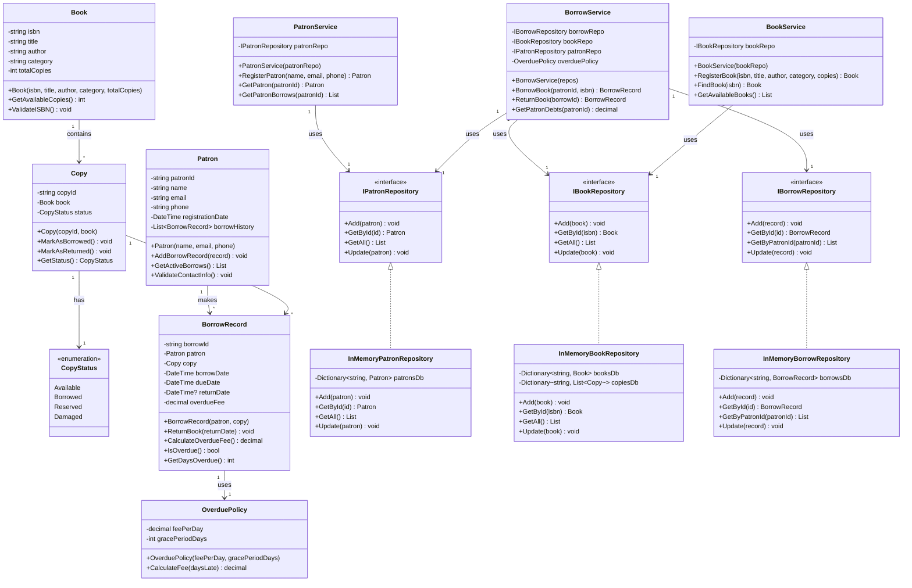

# Діаграма Класів - Система Управління Бібліотекою

## Пояснення Діаграми

**Шар Домену (Зелений):**
- Основні бізнес-сутності з інкапсульованими властивостями та валідацією
- `Book`, `Copy`, `Patron`, `BorrowRecord`, `OverduePolicy`
- Містить усі бізнес-правила та інваріанти

**Шар Застосунку (Синій):**
- Оркестрація бізнес-логіки
- `PatronService`, `BorrowService`, `BookService`
- Використовує ін'єкцію залежностей для доступу до репозиторіїв
- Координує між доменом та інфраструктурою

**Шар Інфраструктури (Помаранчевий):**
- Інтерфейси репозиторіїв для абстракції доступу до даних
- In-memory реалізації для Ітерації 1
- Буде розширено реалізаціями SQL в Ітерації 2

**Ключові Паттерни Проектування, що Використані:**
1. **Паттерн Репозиторій** - Абстракція доступу до даних
2. **Паттерн Сервіс** - Інкапсуляція бізнес-логіки
3. **Ін'єкція Залежностей** - Роз'єднання між шарами
4. **Value Object** - Перерахування `CopyStatus`
5. **Інкапсуляція** - Приватні поля з валідацією в конструкторах
## Розширення для Ітерації 2
- Додано `IDataStore<T>` та `JsonFileDataStore<T>` для збільшення персистентності
- Додано `LibraryPersistenceService` для збереження/відновлення стану
- Введено `LibraryQueryService` як шар запитів і аналітики
- `IOverduePolicy` використовується як Strategy для тарифів штрафів
