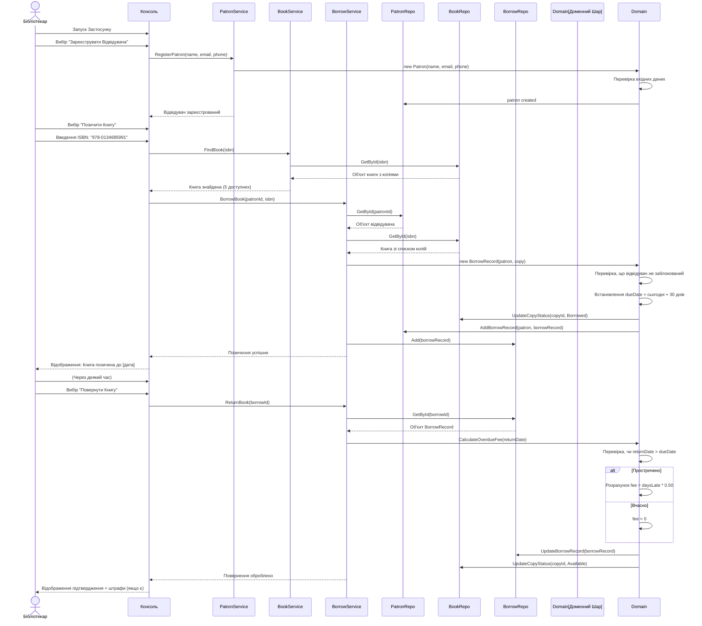
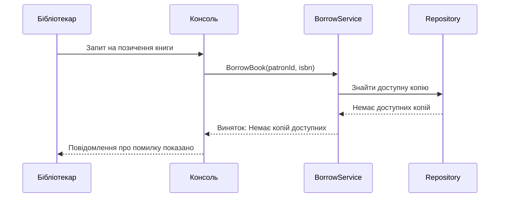
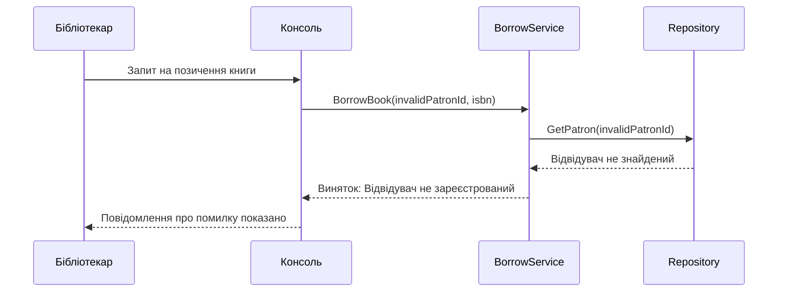

# Діаграма Послідовності - Сценарій Позичення та Повернення Книги

## Основний Потік: Позичення та Повернення Книги

## Сценарії Винятків

### Сценарій: Книга Недоступна

### Сценарій: Невалідний Відвідувач

## Покриття Вертикального Зрізу

Діаграма послідовності демонструє **повний вертикальний зріз**, що:

1. **Починається з UI** - Користувач взаємодіє з консоллю
2. **Проходить через Шар Застосунку** - PatronService, BookService, BorrowService оркеструють бізнес-логіку
3. **Досягає Шару Домену** - Бізнес-правила забезпечуються (валідація, розрахунок штрафів)
4. **Використовує Інфраструктуру** - Репозиторії зберігають стан in-memory
5. **Повертається до UI** - Результати відображаються користувачу

Це забезпечує:
- Чітке розділення відповідальності
- Тестованість на кожному рівні
- Майбутню розширюваність (заміна in-memory на SQL)
- Обробку помилок на межах домену
